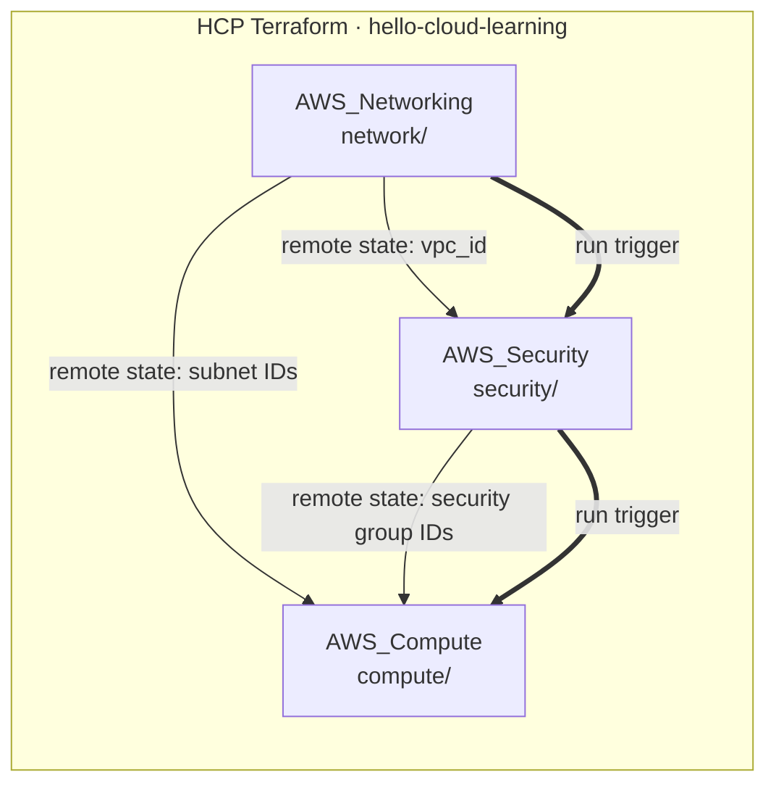
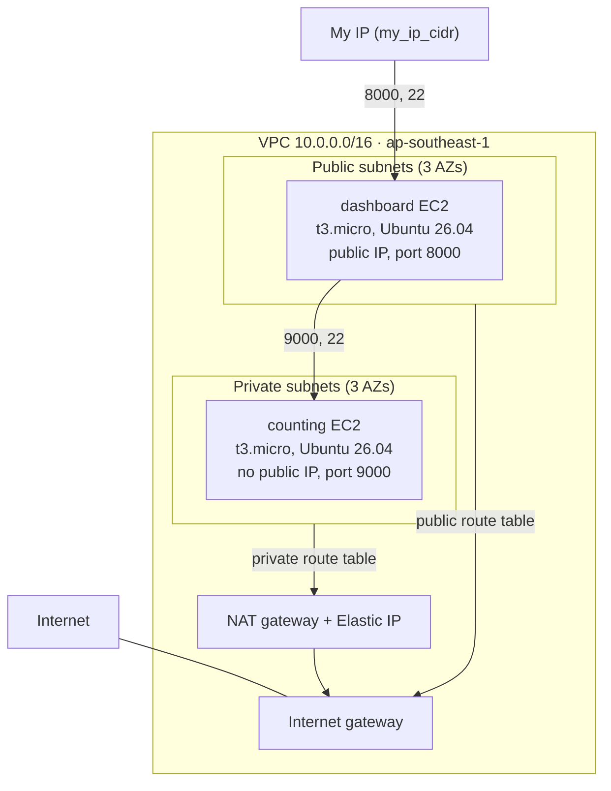
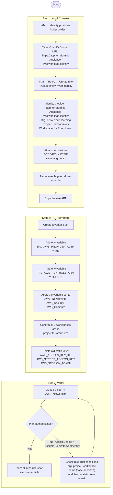
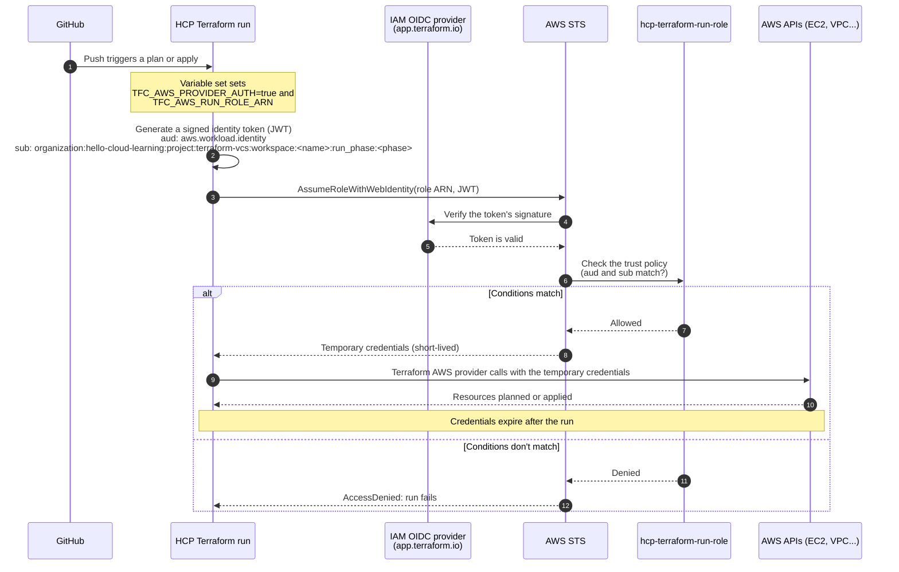

# Terraform VCS Workflow with HCP Terraform

A Counting/Dashboard demo on AWS using three VCS-connected HCP Terraform workspaces: networking, security and compute. Each workspace reads the previous one's outputs through remote state, run triggers chain them in order, and runs authenticate to AWS with short-lived OIDC credentials instead of static keys.

This project uses **HCP Terraform Free**, with the **Policy Set and OPA Policy created manually in the HCP Terraform UI**. Infrastructure and OPA policy code are versioned in this repository; policy changes are copied manually into HCP Terraform. The Terraform configuration does not create the policy set or policy.

## Repository structure

```text
network/                         VPC, subnets, internet gateway, NAT gateway, routing
security/                        Security groups for the dashboard and counting instances
compute/                         Counting and dashboard EC2 instances
scripts/                         user_data scripts for the two instances
opa/policies.hcl                 Policy query and enforcement reference
opa/policies/public_ingress.rego  OPA policy to copy into HCP Terraform
```

## Architecture

### Workspaces, state sharing and run triggers



Thin arrows are remote state reads (`terraform_remote_state`); thick arrows are run triggers. Apply order is **Networking, then Security, then Compute**.

### AWS resource layout



## Infrastructure

| Directory | HCP Terraform workspace | Resources |
| --- | --- | --- |
| `network/` | `AWS_Networking` | VPC, three public and three private subnets, internet gateway, public route table, NAT gateway with Elastic IP, private route table and associations |
| `security/` | `AWS_Security` | Dashboard and counting security groups with their rules |
| `compute/` | `AWS_Compute` | `counting` and `dashboard` EC2 instances |

All configurations target organization `hello-cloud-learning` and default to AWS region `ap-southeast-1` (Singapore). The AWS provider constraint is `~> 6.0`.

### Instances

| Instance | Subnet | Public IP | Service (port) | user_data |
| --- | --- | --- | --- | --- |
| `counting` | First private subnet | No | counting-service (9000) | `scripts/counting-service.sh` |
| `dashboard` | Second public subnet | Yes | dashboard-service (8000) | `scripts/dashboard-service.sh` |

- Both are `t3.micro` on Ubuntu 26.04 (Canonical AMI `ubuntu-resolute-26.04-amd64-server-20260604`) and use the existing key pair `boundary-keypair`.
- The dashboard script receives the counting instance's private IP through `templatefile`, so counting is created first.
- `user_data_replace_on_change = true`, so editing a script recreates that instance. `user_data` only runs on first boot.
- The counting instance reaches the internet (apt, GitHub) through the NAT gateway. Without it the service never installs.

### Security groups

| Group | Inbound | Source |
| --- | --- | --- |
| Dashboard | TCP 8000, TCP 22 | `my_ip_cidr` |
| Counting | TCP 9000, TCP 22 | Dashboard security group |

Both groups allow all outbound traffic. `my_ip_cidr` is a required variable with no default and rejects `0.0.0.0/0`.

## HCP Terraform setup

1. Connect this repository to HCP Terraform through your VCS provider.
2. Create the three workspaces below, using the same repository and your deployment branch:

   | Workspace | Terraform working directory |
   | --- | --- |
   | `AWS_Networking` | `network` |
   | `AWS_Security` | `security` |
   | `AWS_Compute` | `compute` |

3. Configure AWS authentication for remote runs with **dynamic credentials (OIDC)**, as described in [AWS dynamic credentials (OIDC)](#aws-dynamic-credentials-oidc). Do not set static `AWS_ACCESS_KEY_ID` or `AWS_SECRET_ACCESS_KEY` values in the workspaces. Leave the Terraform variable `aws_profile` unset (`null`) for HCP runs; for local runs use `-var aws_profile=aws-master-admin`.
4. In `AWS_Security`, add the Terraform variable `my_ip_cidr` (for example `203.0.113.10/32`). Runs fail without it.
5. Enable **remote state sharing** (Settings, General, Remote state sharing, share with specific workspaces):

   | Workspace being read | Share with |
   | --- | --- |
   | `AWS_Networking` | `AWS_Security`, `AWS_Compute` |
   | `AWS_Security` | `AWS_Compute` |

6. Add **run triggers** on the downstream workspace (Settings, Run Triggers):

   | Workspace | Source workspace |
   | --- | --- |
   | `AWS_Security` | `AWS_Networking` |
   | `AWS_Compute` | `AWS_Security` |

7. Plan and apply `AWS_Networking` first. Run triggers only fire after a successful apply, so the first run needs a manual apply. Auto-apply can be enabled on the downstream workspaces for a hands-off chain.
8. Configure or verify the manually managed OPA policy described below.

If using another organization or workspace names, update the `cloud` blocks in each `versions.tf` and the `terraform_remote_state` configuration in `security/security-groups.tf` and `compute/ec2.tf` together.

### AWS dynamic credentials (OIDC)

HCP Terraform authenticates to AWS with a short-lived token for each run. No long-lived AWS keys are stored in the workspaces. This is configured once in AWS and once in HCP Terraform, both by hand.

**Setup flow**



**What happens on every run**



In the trust check (steps 5 to 7), AWS compares the token's `sub` claim with the role's trust conditions. Here that is `organization:hello-cloud-learning:project:terraform-vcs:workspace:*:run_phase:*`, so any workspace in the `terraform-vcs` project passes and anything else is denied.

**1. AWS: IAM identity provider and role**

Create an IAM OIDC identity provider for `app.terraform.io` (provider URL `https://app.terraform.io`, audience `aws.workload.identity`), then an IAM role named `hcp-terraform-run-role` that trusts it. The role was created in the console with these values:

| AWS IAM field | Value |
| --- | --- |
| Identity Provider | `app.terraform.io` |
| Audience | `aws.workload.identity` |
| Workload Type | Workspace Run |
| Organization | `hello-cloud-learning` |
| Project Name | `terraform-vcs` |
| Workspace Name | `*` |
| Run Phase | `*` |

This limits the role to runs from the `hello-cloud-learning` organization and the `terraform-vcs` project. Because the workspace name and run phase are `*`, any workspace in that project can assume it. Replace `*` with specific workspace names (`AWS_Networking`, `AWS_Security`, `AWS_Compute`) for tighter access. Attach only the permissions these workspaces need (EC2, VPC, NAT gateway and Elastic IP, security groups).

**2. HCP Terraform: variable set**

Create one **variable set** and apply it to `AWS_Networking`, `AWS_Security` and `AWS_Compute`. It holds two environment variables:

| Key | Value |
| --- | --- |
| `TFC_AWS_PROVIDER_AUTH` | `true` |
| `TFC_AWS_RUN_ROLE_ARN` | ARN of `hcp-terraform-run-role` |

Each workspace must be in the `terraform-vcs` project, or the role's trust policy rejects its runs. Remove any static `AWS_ACCESS_KEY_ID`, `AWS_SECRET_ACCESS_KEY` and `AWS_SESSION_TOKEN` variables from the workspaces. No Terraform code change is needed: the AWS provider picks up the credentials automatically.

**3. Verify**

Queue a plan in `AWS_Networking`. It should authenticate and plan without any static keys. An `AccessDenied` or `Not authorized to perform sts:AssumeRoleWithWebIdentity` error means the role's trust conditions do not match the workspace's organization, project or name (they are case-sensitive).

### Terraform variables

Set overrides as **Terraform variables** in the appropriate HCP workspace.

| Variable | Workspace | Default |
| --- | --- | --- |
| `region` | All | `ap-southeast-1` |
| `project_name` | All | `tf-vcs-singapore` |
| `environment` | All | `dev` |
| `aws_profile` | All | `null` |
| `vpc_cidr` | Network | `10.0.0.0/16` |
| `availability_zones` | Network | `ap-southeast-1a`, `ap-southeast-1b`, `ap-southeast-1c` |
| `public_subnet_cidrs` | Network | `10.0.0.0/24`, `10.0.1.0/24`, `10.0.2.0/24` |
| `private_subnet_cidrs` | Network | `10.0.10.0/24`, `10.0.11.0/24`, `10.0.12.0/24` |
| `my_ip_cidr` | Security | none (required) |
| `instance_type` | Compute | `t3.micro` |
| `key_name` | Compute | `boundary-keypair` |

For list variables, enable HCL input in HCP Terraform and enter a list such as `["ap-southeast-1a", "ap-southeast-1b", "ap-southeast-1c"]`. Keep subnet CIDR lists aligned with the availability zones, and use matching regions in all workspaces.

### Connecting to the instances

```text
# Dashboard UI: http://<dashboard_public_ip>:8000
ssh -i boundary-keypair.pem ubuntu@<dashboard_public_ip>

# Counting (private), by jumping through the dashboard
ssh -i boundary-keypair.pem -J ubuntu@<dashboard_public_ip> ubuntu@<counting_private_ip>
```

Setup logs are in `/var/log/counting-service.log` and `/var/log/dashboard-service.log` on each instance.

## Manually managed OPA policy

The Policy Set and Policy for this setup were manually defined in HCP Terraform. To reproduce or review the configuration:

1. In the organization's policy settings, create or select an **individually managed** policy set with **Open Policy Agent (OPA)** as its framework.
2. Scope it to `AWS_Security`, where the security groups are managed. Add other workspaces only if appropriate for your policy.
3. Create or select an OPA policy named `public_ingress`, paste the contents of [`opa/policies/public_ingress.rego`](opa/policies/public_ingress.rego) into HCP Terraform, and add it to the policy set.
4. Verify its query and enforcement mode. The repository's `opa/policies.hcl` records the intended settings:

   | Setting | Repository reference |
   | --- | --- |
   | Policy name | `public_ingress` |
   | Query | `data.terraform.security.deny` |
   | Enforcement | `mandatory` |

The query must match the package and rule in the Rego code saved in HCP. OPA policy queries must return an array; an empty array indicates a pass and a nonempty array indicates a failure. See HashiCorp's [OPA policy documentation](https://developer.hashicorp.com/terraform/cloud-docs/policy-enforcement/define-policies/opa) and [policy management guide](https://developer.hashicorp.com/terraform/cloud-docs/policy-enforcement/manage-policy-sets).

Committing changes under `opa/` does **not** update an individually managed policy in HCP Terraform. After reviewing and merging a policy change, copy the updated Rego file into the HCP policy editor and confirm that the query remains `data.terraform.security.deny`. The `policies.hcl` file records the intended settings for reference; it is not automatically loaded by this manual setup. The live HCP configuration is not verified by this repository.

### Policy behavior

The policy uses Rego v1 syntax and reads HCP's plan data from `input.plan`. It collects IPv4 CIDRs from both standalone `aws_vpc_security_group_ingress_rule` resources and inline `aws_security_group.ingress` blocks. It inspects the planned `after` values without limiting checks to create actions.

- Denies ingress from `0.0.0.0/0`.
- Allows source strings beginning with `10.`.
- Requires other IPv4 sources to end with `/32`.

| Example source | Expected result |
| --- | --- |
| `10.0.0.0/16` | Pass |
| `my_ip_cidr` as a `/32` (current configuration) | Pass |
| `192.168.1.0/24` | Deny: sources outside `10.*` must use `/32` |
| `0.0.0.0/0` | Deny: produces both public-ingress and non-`/32` messages |

These are string checks, not CIDR containment checks. The policy does not evaluate IPv6, security group references (used by the counting rules), prefix lists, or egress rules. Missing or unknown CIDRs do not produce a denial through these rules.

To verify the live policy, use a pull request with a speculative plan that changes an ingress CIDR (such as `my_ip_cidr`) to `0.0.0.0/0`. Confirm that the policy reports a violation, then revert the test change without applying it. Also verify that the restricted CIDR passes. Do not assume a passing check proves coverage unless the failing case is tested.

## Day-to-day workflow

1. Create a branch, edit Terraform, and open a pull request.
2. Review the HCP Terraform speculative plan and applicable policy results.
3. Merge the approved change into the workspace's tracked branch.
4. Review the resulting run and approve the apply when manual approval is configured.

Apply order matters: Networking, then Security, then Compute. Run triggers queue the downstream runs automatically after a successful apply.

Outputs:
- Network: `vpc_id`, `public_subnet_ids`, `private_subnet_ids`
- Security: `dashboard_security_group_id`, `counting_security_group_id`
- Compute: `counting_instance_id`, `counting_private_ip`, `dashboard_instance_id`, `dashboard_public_ip`

## Troubleshooting

| Symptom | Cause and fix |
| --- | --- |
| "not authorized to read the state of workspace" | Remote state sharing is not enabled. Share the source workspace with the consumer (see setup step 5). |
| "No value for required variable my_ip_cidr" | Add `my_ip_cidr` as a Terraform variable in `AWS_Security`. |
| Dashboard gets "connection refused" from counting | The service never installed, usually because the private subnet had no outbound route (NAT). Fix the route, then recreate the instance, since `user_data` only runs on first boot: run `aws_instance.counting` through **Replace resources** in `AWS_Compute`. |
| `Not authorized to perform sts:AssumeRoleWithWebIdentity` | The workspace is outside the `terraform-vcs` project, or the role's trust conditions do not match its organization or name. Check the role's trust policy and the workspace's project. |
| Security group delete fails with a dependent object | Destroy `AWS_Compute` first, then `AWS_Security`. |
| Policy error `expected ident` | The policy is Sentinel code in a `.rego` file. HCP OPA policies must be Rego. |
| Changing the AMI, key pair, subnet, `user_data` or a security group description | Replaces the resource. Expect the instances to be recreated. |

## Cleanup

Destroy resources through HCP Terraform in reverse dependency order: **`AWS_Compute`, then `AWS_Security`, then `AWS_Networking`** (Settings, Destruction and Deletion, Queue destroy plan). Run triggers do not fire on destroys, so queue each one manually. The NAT gateway costs about $0.045/hour plus data, and other AWS resources can incur charges even when HCP Terraform is on the Free plan.

The IAM OIDC identity provider and `hcp-terraform-run-role` are created by hand and are not removed by these destroys. Delete them in the AWS console when you are finished with the whole project.
