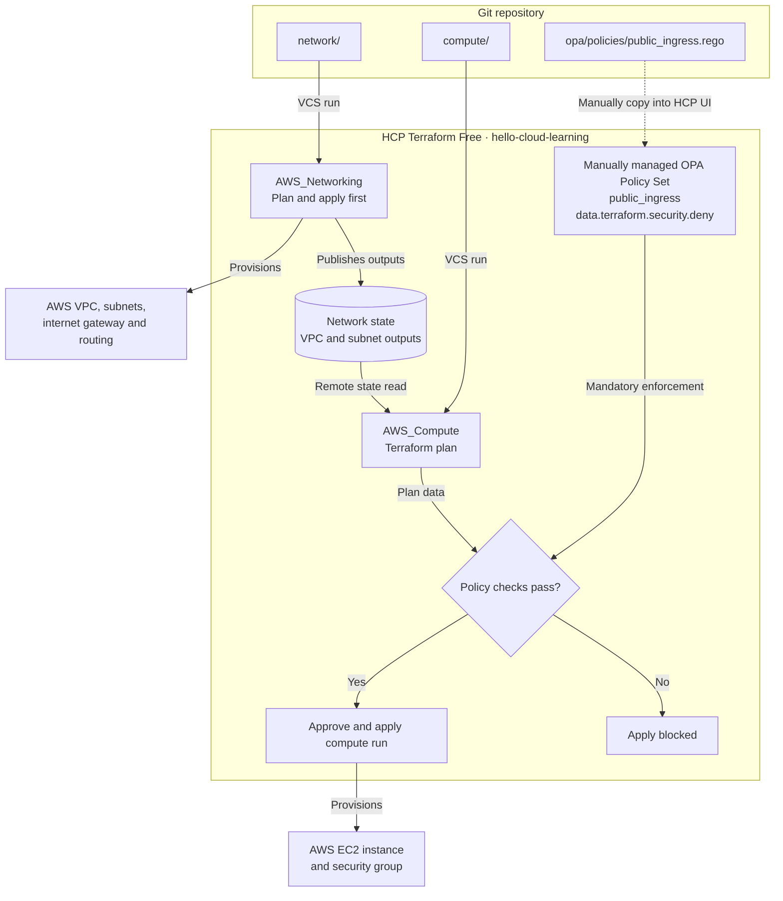
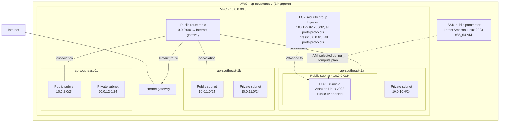

# Terraform VCS Workflow with HCP Terraform

An AWS infrastructure demo using two VCS-connected HCP Terraform workspaces: one for networking and one for compute. Compute reads the network workspace's outputs through remote state.

This project uses **HCP Terraform Free**, with the **Policy Set and OPA Policy created manually in the HCP Terraform UI**. Infrastructure and OPA policy code are versioned in this repository; policy changes are copied manually into HCP Terraform. The Terraform configuration does not create the policy set or policy.

## Repository structure

```text
network/                         VPC, subnets, internet gateway, and routing
compute/                         EC2 instance and security group
opa/policies.hcl                 Policy query and enforcement reference
opa/policies/public_ingress.rego  OPA policy to copy into HCP Terraform
```

## Architecture

### VCS, workspaces, and policy checks



The diagram shows the intended policy attachment to `AWS_Compute` and manual apply approval. Policy changes require a manual copy into HCP; a Git push does not synchronize the policy. Remote state sharing must be enabled, and reading network outputs does not automatically trigger a compute run.

### AWS resource layout



This layout reflects the default variables. The network workspace manages the VPC and networking resources; the compute workspace manages the EC2 instance and its security group. Solid connections show route configuration and associations; dotted connections show resource configuration dependencies. Private subnets have no configured internet egress or NAT gateway.

## Infrastructure

| Directory | HCP Terraform workspace | Resources |
| --- | --- | --- |
| `network/` | `AWS_Networking` | VPC, three public subnets, three private subnets, internet gateway, public route table and associations |
| `compute/` | `AWS_Compute` | One Amazon Linux 2023 EC2 instance and its security group |

Both configurations target organization `hello-cloud-learning` and default to AWS region `ap-southeast-1` (Singapore). The AWS provider constraint is `~> 6.0`.

The EC2 instance uses the first public subnet, receives a public IP, and defaults to `t3.micro`. Its AMI is resolved from the AWS Systems Manager public parameter for the latest Amazon Linux 2023 x86_64 image. Private subnets have no NAT gateway or configured internet egress.

The security group currently allows all inbound protocols and ports **from `180.129.82.208/32` only**, and all outbound traffic to `0.0.0.0/0`. Its `allow_all` name refers to ports and protocols; inbound access is restricted to that source address. Review the address before using this demo.

## HCP Terraform setup

1. Connect this repository to HCP Terraform through your VCS provider.
2. Create the two workspaces below, using the same repository and your deployment branch:

   | Workspace | Terraform working directory |
   | --- | --- |
   | `AWS_Networking` | `network` |
   | `AWS_Compute` | `compute` |

3. Configure AWS credentials for remote runs in both workspaces. If using environment variables, set `AWS_ACCESS_KEY_ID` and `AWS_SECRET_ACCESS_KEY` as sensitive values, plus `AWS_SESSION_TOKEN` for temporary credentials. Keep temporary credentials current. Leave the Terraform variable `aws_profile` unset (`null`) for HCP runs.
4. In the network workspace's remote state sharing settings, allow `AWS_Compute` to access its state.
5. Plan and apply `AWS_Networking` first. Its outputs must exist before the compute workspace can plan successfully.
6. Configure or verify the manually managed OPA policy described below, then plan and apply `AWS_Compute`.

If using another organization or workspace names, update the `cloud` blocks in both `versions.tf` files and the remote state configuration in `compute/ec2.tf` together.

### Terraform variables

Set overrides as **Terraform variables** in the appropriate HCP workspace.

| Variable | Workspace | Default |
| --- | --- | --- |
| `region` | Both | `ap-southeast-1` |
| `project_name` | Both | `tf-vcs-singapore` |
| `environment` | Both | `dev` |
| `aws_profile` | Both | `null` |
| `vpc_cidr` | Network | `10.0.0.0/16` |
| `availability_zones` | Network | `ap-southeast-1a`, `ap-southeast-1b`, `ap-southeast-1c` |
| `public_subnet_cidrs` | Network | `10.0.0.0/24`, `10.0.1.0/24`, `10.0.2.0/24` |
| `private_subnet_cidrs` | Network | `10.0.10.0/24`, `10.0.11.0/24`, `10.0.12.0/24` |
| `instance_type` | Compute | `t3.micro` |

For list variables, enable HCL input in HCP Terraform and enter a list such as `["ap-southeast-1a", "ap-southeast-1b", "ap-southeast-1c"]`. Keep subnet CIDR lists aligned with the availability zones, and use matching regions in both workspaces.

## Manually managed OPA policy

The Policy Set and Policy for this setup were manually defined in HCP Terraform. To reproduce or review the configuration:

1. In the organization's policy settings, create or select an **individually managed** policy set with **Open Policy Agent (OPA)** as its framework.
2. Scope it to `AWS_Compute`, where the security group is managed. Add other workspaces only if appropriate for your policy.
3. Create or select an OPA policy named `public_ingress`, paste the contents of [`opa/policies/public_ingress.rego`](opa/policies/public_ingress.rego) into HCP Terraform, and add it to the policy set.
4. Verify its query and enforcement mode. The repository's `opa/policies.hcl` records the intended settings:

   | Setting | Repository reference |
   | --- | --- |
   | Policy name | `public_ingress` |
   | Query | `data.terraform.security.deny` |
   | Enforcement | `mandatory` |

The query must match the package and rule in the Rego code saved in HCP. OPA policy queries must return an array; an empty array indicates a pass and a nonempty array indicates a failure. See HashiCorp's [OPA policy documentation](https://developer.hashicorp.com/terraform/cloud-docs/policy-enforcement/define-policies/opa) and [policy management guide](https://developer.hashicorp.com/terraform/cloud-docs/policy-enforcement/manage-policy-sets).

Committing changes under `opa/` does **not** update an individually managed policy in HCP Terraform. After reviewing and merging a policy change, copy the updated Rego file into the HCP policy editor and confirm that the query remains `data.terraform.security.deny`. The `policies.hcl` file records the intended settings for reference; it is not automatically loaded by this manual setup. The live HCP configuration is not verified by this repository.

### Policy behavior

The policy uses Rego v1 syntax and reads HCP's plan data from `input.plan`. It collects IPv4 CIDRs from both standalone `aws_vpc_security_group_ingress_rule` resources and inline `aws_security_group.ingress` blocks, including the inline rule used in this project. It inspects the planned `after` values without limiting checks to create actions.

- Denies ingress from `0.0.0.0/0`.
- Allows source strings beginning with `10.`.
- Requires other IPv4 sources to end with `/32`.

| Example source | Expected result |
| --- | --- |
| `10.0.0.0/16` | Pass |
| `180.129.82.208/32` (current configuration) | Pass |
| `192.168.1.0/24` | Deny: sources outside `10.*` must use `/32` |
| `0.0.0.0/0` | Deny: produces both public-ingress and non-`/32` messages |

These are string checks, not CIDR containment checks. The policy does not evaluate IPv6, security group references, prefix lists, or egress rules. Missing or unknown CIDRs do not produce a denial through these rules.

To verify the live policy, use a pull request with a speculative plan that changes the inline ingress CIDR to `0.0.0.0/0`. Confirm that the policy reports a violation, then revert the test change without applying it. Also verify that the restricted CIDR passes. Do not assume a passing check proves coverage unless the failing case is tested.

## Day-to-day workflow

1. Create a branch, edit Terraform, and open a pull request.
2. Review the HCP Terraform speculative plan and applicable policy results.
3. Merge the approved change into the workspace's tracked branch.
4. Review the resulting run and approve the apply when manual approval is configured.

Apply network changes before compute changes that depend on new network outputs. Reading remote state does not itself trigger a compute run; queue one when needed, or configure an HCP run trigger separately.

Network outputs: `vpc_id`, `public_subnet_ids`, `private_subnet_ids`.
Compute outputs: `instance_id`, `public_ip`.

## Cleanup

Destroy resources through HCP Terraform in dependency order: **`AWS_Compute` first, then `AWS_Networking`**. AWS resources can incur charges even when HCP Terraform is on the Free plan.
